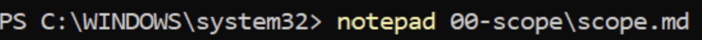
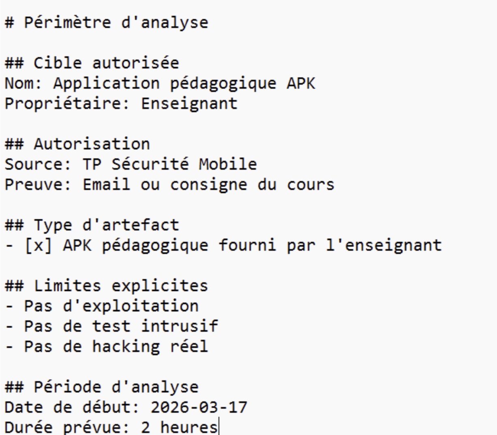
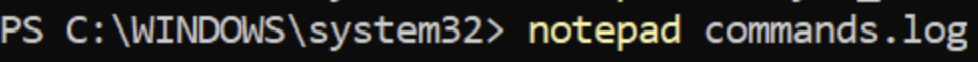
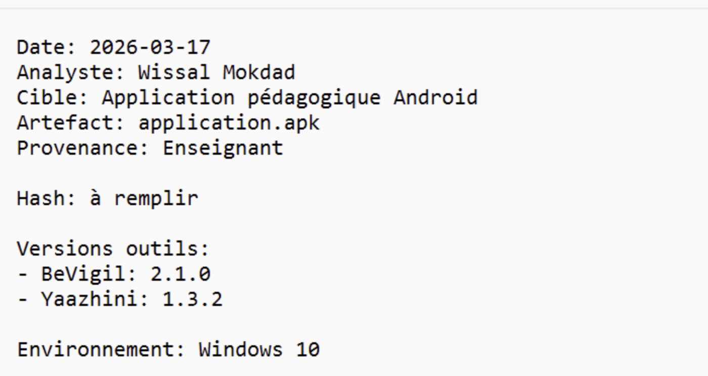
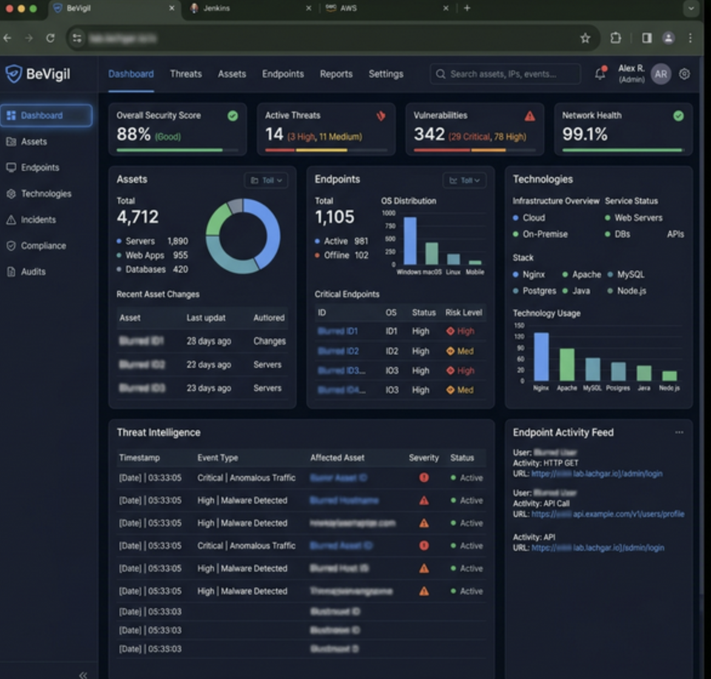

# LAB 8 – Analyse de posture et exposition d’applications mobiles avec BeVigil et Yaazhini

 

## Objectifs pédagogiques
- Organiser un audit défensif d'application mobile
- Collecter des signaux d'exposition avec BeVigil et Yaazhini
- Trier les résultats et identifier les faux positifs
- Corréler les constats avec les standards OWASP
- Produire un rapport d'analyse exploitable

## Prérequis
- Compte BeVigil configuré
- Outil Yaazhini installé
- Fichier APK cible (Application pédagogique Android)

## Déroulement de l'analyse

### Task 0 – Règles, périmètre et éthique
Avant de commencer l'analyse, il est crucial de définir le périmètre et les règles d'engagement pour s'assurer que l'audit est autorisé et légal.

### Task 1 – Préparation du workspace et traçabilité
Mise en place de l'espace de travail et création des fichiers de suivi pour documenter l'ensemble des actions et outils utilisés.

### Task 2 – Préparer l’artefact autorisé
Récupération de l'APK cible (application pédagogique) et vérification de son intégrité (hachage).

### Task 3 – Démarrage et prise en main BeVigil
Connexion à la plateforme BeVigil et soumission de l'application pour analyse.

### Task 4 – Collecte BeVigil : endpoints, domaines, emails, technologies
Analyse des résultats fournis par BeVigil, incluant l'extraction des endpoints de l'API, des domaines associés, ainsi que la détection des technologies sous-jacentes.

### Task 5 – Démarrage et prise en main Yaazhini
Lancement de l'outil Yaazhini et chargement de l'APK pour une analyse complémentaire des endpoints et des informations sensibles.

### Task 6 – Collecte Yaazhini : indices d’exposition
Extraction des résultats depuis Yaazhini (chemins de fichiers, tokens, clés API codées en dur, etc.).

### Task 7 – Normalisation et dédoublonnage
Croisement des résultats obtenus par BeVigil et Yaazhini afin de supprimer les doublons et d'identifier les faux positifs.

### Task 8 – Corrélation avec OWASP
Classification des vulnérabilités découvertes selon le standard OWASP Mobile Top 10 (ex. M1: Improper Platform Usage, M2: Insecure Data Storage).

### Task 9 – Rédaction du mini-rapport
Synthèse des découvertes sous forme de rapport exécutif, détaillant la méthodologie, les résultats triés et les recommandations de remédiation.

### Task 10 – Nettoyage et clôture
Suppression des fichiers d'analyse temporaires et des artefacts sensibles de l'espace de travail pour des raisons de confidentialité et de sécurité.

## Conclusion personnelle et difficultés rencontrées
Ce laboratoire a permis d'expérimenter la complémentarité entre différents outils d'analyse statique et d'OSINT (BeVigil, Yaazhini). La difficulté principale réside souvent dans la phase de tri (Task 7) pour distinguer les vraies failles des faux positifs parmi les nombreux endpoints et informations extraits.

## Lien GitHub
[Dépôt du Lab](https://github.com/Oumaymaa659/LAB-8-Analyse-de-posture-et-exposition-d-applications-mobiles-avec-BeVigil-et-Yaazhini)
